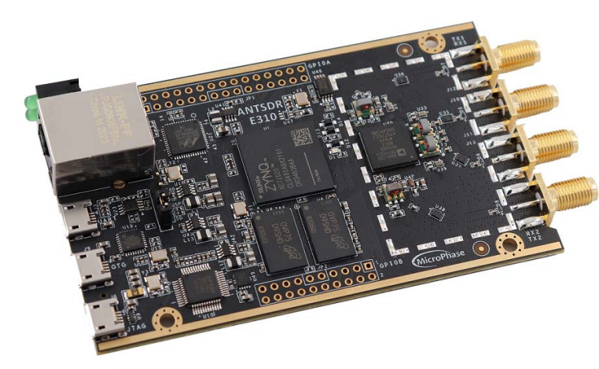

# antsdr-fw
[ANTSDR Firmware](https://github.com/MicroPhase/antsdr-fw) for the [ANTSDR](https://item.taobao.com/item.htm?spm=a230r.1.14.16.34e21142YIlxqx&id=647986963313&ns=1&abbucket=2#detail) .
This project is forked from ADI [ADALM-PLUTO ](https://github.com/analogdevicesinc/plutosdr-fw) 

## Build Instructions<br> 
The ANTSDR Firmware is built with the [Xilinx Vivado 2019.1](https://www.xilinx.com/member/forms/download/xef-vivado.html?filename=Xilinx_Vivado_SDK_Web_2019.1_0524_1430_Lin64.bin). You need to install the correct Vivado Version in your linux PC, and then, you can follow the instructions below to generate the firmware for [ANTSDR B220](https://item.taobao.com/item.htm?spm=a230r.1.14.16.34e21142YIlxqx&id=647986963313&ns=1&abbucket=2#detail).
```bash
sudo apt-get install git build-essential fakeroot libncurses5-dev libssl-dev ccache 
sudo apt-get install dfu-util u-boot-tools device-tree-compiler libssl1.0-dev mtools
sudo apt-get install bc python cpio zip unzip rsync file wget 
git clone --recursive https://github.com/MicroPhase/antsdr-fw.git 
cd ansdr-fw 
export CROSS_COMPILE=arm-linux-gnueabihf- 
export PATH=$PATH:/opt/Xilinx/SDK/2019.1/gnu/aarch32/lin/gcc-arm-linux-gnueabi/bin 
export VIVADO_SETTINGS=/opt/Xilinx/Vivado/2019.1/settings64.sh make
```

